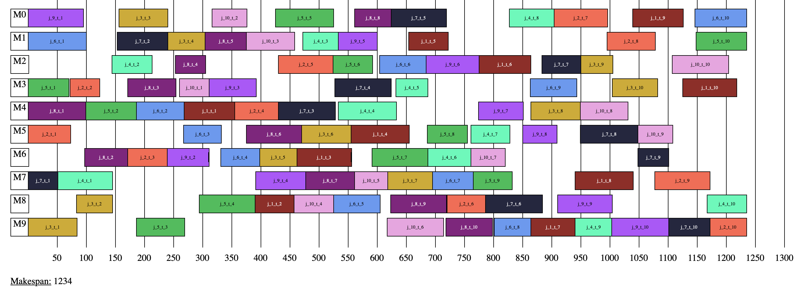
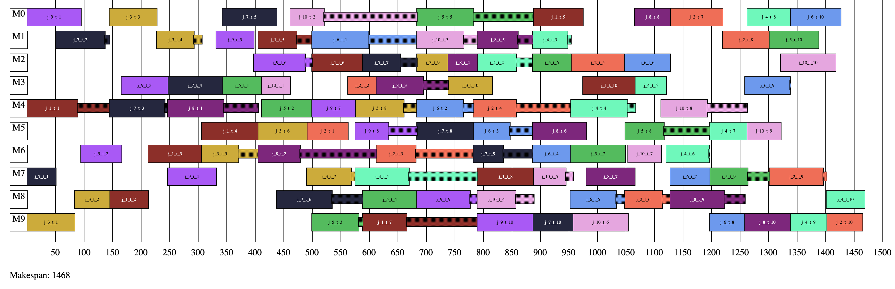

# Job Shop Scheduling

Walter Sebastian Gisler //
May 9, 2020

## Motivation

Job shop scheduling problems are complicated combinatorial problems. They are widely studied and real life examples are present in manufacturing companies, rail road scheduling, sports scheduling etc. No efficient optimal methods exist and normally heuristics are used to find quality solutions quickly.

Constraint programming solvers have also been used widely. They allow rapid prototyping and fast adjustments of the code to meet varying real life constraints, which is often more challenging with custom built heuristics.

I have been using CP Optimizer, which is distributed as part of the IBM CPLEX Studio almost exclusively for scheduling problems that have elements of job shop scheduling problems. However, CP Optimizer is expensive, which is why alternatives are needed. It is hard to compare constraint programming solvers, because they don't use a common input format (like for example MIP solvers). That makes benchmarking them more challenging, because it means that for each of them, a custom model has to be written (unless you use MiniZinc, but even that doesn't support all solvers). I therefore decided to implement some common problems, for which benchmarking instances exist using CP Optimizer and other, freely available optimizers.

## What is the job shop scheduling problem?

A job shop scheduling problem consists of sequencing a number of jobs on different machines. Each job consists of a number of tasks that have to be processed in a given order. Each task has a given duration and a machine on which it has to be processed.

Typically, we want to minimize the total time that is needed to complete all jobs. There is an exponential number of possible solutions, and the problem is NP-complete.

For this benchmarking, we are considering two types of job shop scheduling problems:
- Simple job shop scheduling problem: the normal case
- Blocking job shop scheduling problem: there is no room to store jobs between machines. This implies, that a task that is completed is blocking the machine it is on until it is moved to the next machine

Simple job shop solution: abz5

Blocking job shop solution: abz5 (blocking operations are dotted)

### Variations

Various variations and extensions of the job shop scheduling problem exist, for example job shop scheduling with sequence dependent setup times, flexible job shop scheduling problems (with a choice of >= 1 machines for each task) etc.

## Benchmarking instances

The benchmarking instances are commonly known instances that are widely used in literature. I took the from the following repository: https://github.com/tamy0612/JSPLIB

The format can be read as follows:

- Line comments start with a hashtag: # this is a comment
- The first line that is not a comment in each instance file contains the number of jobs and the number of machines
- Each following line after that represents a job. Each job is made up of tuples of numbers. Each tuple is representing a task and the tasks are in the order they are supposed ot be processed in. The first number of task tuple defines which machine a job is supposed to be processed on and the second tuple gives the duration of each task

## Structure of this repository

- readme.md: this document
- instances.json: overview of all instances
- instances/ : for each instance, there is a file in this folder
- code/benchmarking: code to run the benchmarking automatically
- code/job_shop_blocking: code for blocking job shop
- code/job_shop_simple: code for the simple job shop
- code/utils/: code to read and visualize instances and represent the data in a unified way, furthermore, this folder also contains a script to generate visually distinct colors, which can be used to visualize the solutions in a visually appealing Gantt-chart

## Solvers

- CP Optimizer: https://www.ibm.com/analytics/cplex-cp-optimizer
- OR-Tools: https://developers.google.com/optimization
- CPLEX (for a MIP implementation)

## Benchmarking setup

For every instance, we run a series of experiments. Every experiment is repeated 3 times to get an average and worst and best case scenario:

Thread configurations:
- 1 thread
- 2 threads
- 4 threads
- 8 threads

Time limits:
- 10 seconds
- 20 seconds
- 1 minute
- 2 minutes

## Results

A summary of the results can be found in the following tables.

### 1 Threads

Blocking job shop				
				
|                               | 10 seconds  | 20 seconds  | 60 seconds  | 300 seconds |
|-------------------------------|-------------|-------------|-------------|-------------|
| OR-Tools optimality proof     | 9           | 9           | 12          | 24          |
| CP Optimizer optimality proof | 12          | 18          | 22          | 51          |
| CPLEX Optimality proof        | 3           | 3           | 11          | -           |
| OR-Tools wins                 | 37          | 38          | 58          | 61          |
| CP Optimizer wins             | 69          | 65          | 43          | 48          |
| Avg. makespan OR-Tools        | 2385.400612 | 2279.868502 | 2140.513761 | 2021.737003 |
| Avg. makespan CP Optimizer    | 2261.29052  | 2183.425076 | 2117.247706 | 2019.984709 |
				
				
Simple job shop				
				
|                               | 10 seconds  | 20 seconds  | 60 seconds  | 300 seconds |
|-------------------------------|-------------|-------------|-------------|-------------|
| OR-Tools optimality proof     | 51          | 60          | 73          | 105         |
| CP Optimizer optimality proof | 153         | 168         | 185         | 209         |
| CPLEX Optimality proof        | 7           | 36          | 55          | -           |
| OR-Tools wins                 | 0           | 0           | 0           | 0           |
| CP Optimizer wins             | 89          | 84          | 80          | 109         |
| Avg. makespan OR-Tools        | 1470.330275 | 1447.868502 | 1418.486239 | 1388.932722 |
| Avg. makespan CP Optimizer    | 1365.804281 | 1353.171254 | 1343.633028 | 1333.299694 |

### 4 Threads

Blocking job shop

|                               | 10 seconds  | 20 seconds  | 60 seconds  | 300 seconds |
|-------------------------------|-------------|-------------|-------------|-------------|
| OR-Tools optimality proof     | 5           | 9           | 18          | 27          |
| CP Optimizer optimality proof | 12          | 17          | 19          | 53          |
| CPLEX Optimality proof        | 3           | 6           | 18          | -           |
| OR-Tools wins                 | 37          | 47          | 44          | 61          |
| CP Optimizer wins             | 69          | 57          | 59          | 48          |
| Avg. makespan OR-Tools        | 2305.464832 | 2227.697248 | 2125.437309 | 2019.342508 |
| Avg. makespan CP Optimizer    | 2213.721713 | 2161.816514 | 2078.409786 | 2021.541284 |

Simple job shop

|                               | 10 seconds  | 20 seconds  | 60 seconds  | 300 seconds |
|-------------------------------|-------------|-------------|-------------|-------------|
| OR-Tools optimality proof     | 122         | 142         | 173         | 205         |
| CP Optimizer optimality proof | 153         | 171         | 188         | 211         |
| CPLEX Optimality proof        | 6           | 43          | 60          | -           |
| OR-Tools wins                 | 9           | 14          | 20          | 21          |
| CP Optimizer wins             | 61          | 49          | 33          | 88          |
| Avg. makespan OR-Tools        | 1414.070336 | 1390.400612 | 1370.810398 | 1354.192661 |
| Avg. makespan CP Optimizer    | 1369.926606 | 1363.134557 | 1353.654434 | 1346.896024 |

### Summary

Both with 1 and with 4 threads, CP Optimizer is able to proof optimality for more instances than OR Tools. With more runtime, both CP Optimizer and OR Tools increase the number of instances where  optimality can be proven, but OR Tools is not able to catch up. As expected, optimality can be proven more easily for the simple job shop instances. The MIP formulation is falling far behind both OR Tools and CP Optimizer.

The best makespan does not differ very much. For the 1-thread scenario, OR Tools is on average 5-7% worse than CP Optimizer given a 10 second time limit (both for the blocking job shop and the simple job shop). With a higher time limit, this gap is getting smaller and almost disappears.

For the 4 thread scenario, the gap after 10 seconds is smaller: 3-4% and given a 300 second time limit, OR Tools actually beats CP Optimizer for the blocking job shop.

CP Optimizer clearly wins the simple job shop instances but even there, the gap is not very big.

Overall, OR-Tools performed very well and for the fact that it is available for free, it does an amazing job. 